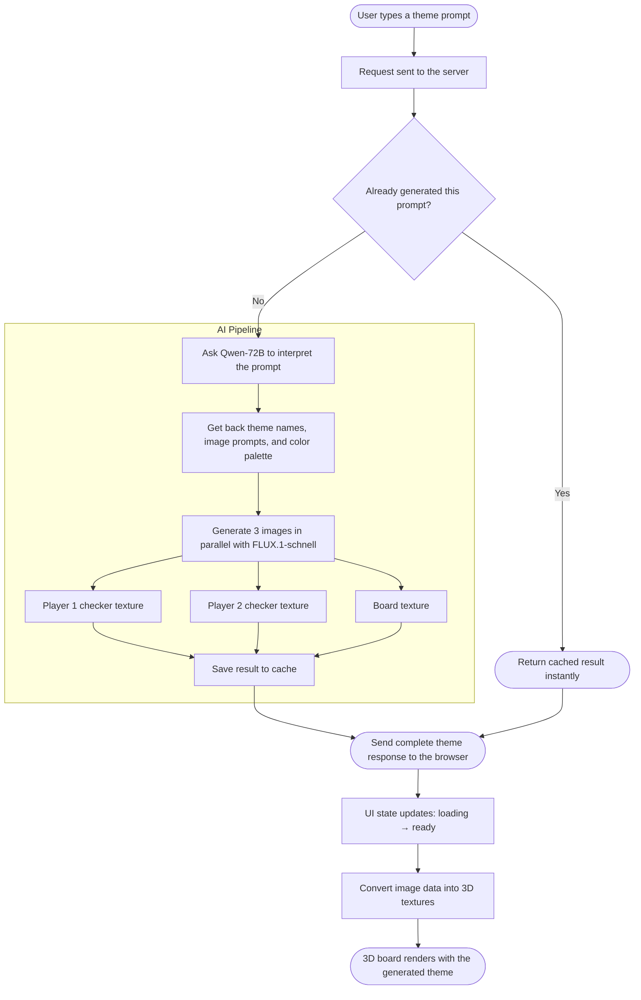

# GenNard — Architecture

AI-powered backgammon where users describe a theme in natural language and the game generates custom checker textures and a board using open-source or proprietary AI models.

---

## Table of Contents

1. [Repository Layout](#1-repository-layout)
2. [Package Overview](#2-package-overview)
3. [Data Flow](#3-data-flow)
4. [Game Engine](#4-game-engine)
5. [Server](#5-server)
6. [Client](#6-client)
7. [Shared Types](#7-shared-types)
8. [Environment Variables](#8-environment-variables)
9. [Deployment](#9-deployment)
10. [Key Design Decisions](#10-key-design-decisions)

---

## 1. Repository Layout

```
GenNard/
├── packages/
│   ├── client/          React + Vite + React Three Fiber frontend
│   ├── game-engine/     Pure TypeScript backgammon logic (zero runtime deps)
│   └── server/          Node.js + Express backend
├── shared/              Types shared between client and server
├── .github/workflows/   GitHub Actions CI/CD pipelines
├── Dockerfile           Multi-stage build for the server (Cloud Run)
├── cloudbuild.yaml      Google Cloud Build pipeline (image build + Cloud Run deploy)
├── firebase.json        Firebase Hosting config + Cloud Run rewrite rules
├── package.json         npm workspaces root
├── tsconfig.base.json   Shared TypeScript config
└── Plan.md              Full product roadmap
```

npm workspaces knit the three packages together. The game-engine is compiled to `dist/` and consumed by both server and client as `@gennard/game-engine`.

---

## 2. Package Overview

| Package | Language | Key deps | Port |
|---------|----------|----------|------|
| `client` | React 19 + TypeScript | Vite, Three.js, React Three Fiber, Zustand | 3000 |
| `game-engine` | TypeScript | none | — |
| `server` | Node.js + TypeScript | Express, ws, Zod, @google/genai, @huggingface/inference | 4000 |

---

## 3. Data Flow

### Theme Generation (the AI pipeline)



### Game Turn Flow

```
User click
  │
  ▼
GamePage (React state)
  │ dispatch action
  ▼
gameReducer (pure function from @gennard/game-engine)
  │ returns new GameState
  ▼
BoardScene re-renders with updated checker positions
```

---

## 4. Game Engine

**Package:** `packages/game-engine` — exported as `@gennard/game-engine`
**Zero runtime dependencies.** All logic is pure functions or reducers.

### Source files

```
src/
├── index.ts          Barrel export
├── types.ts          All TypeScript types (GameState, Move, Player, …)
├── constants.ts      INITIAL_BOARD, NUM_POINTS, home ranges
├── Board.ts          createInitialBoard(), applyMove(), cloneBoard()
├── Dice.ts           rollDice(), getMovesFromRoll(), removeDie()
├── MoveGenerator.ts  generateAllLegalTurns() — recursive algorithm
├── MoveValidator.ts  isLegalMove()
├── BearingOff.ts     canBearOff(), getBearOffMoves()
├── GameState.ts      createNewGame(), checkWinner(), getWinType()
└── GameReducer.ts    gameReducer(state, action) → state
```

### Core types

```typescript
type Player = 'white' | 'black'

// 24-element array: positive = white pieces, negative = black pieces
type BoardPoints = number[]

interface GameState {
  points: BoardPoints
  bar: { white: number; black: number }
  borneOff: { white: number; black: number }
  currentPlayer: Player
  dice: number[]
  phase: GamePhase   // 'rolling_for_first' | 'rolling' | 'moving' | 'game_over'
  winner: Player | null
}

interface Move {
  from: number | 'bar'
  to: number | 'off'
  dieUsed: number
}
```

### Board orientation

```
Points 0–23 (white moves 0→23, black moves 23→0)

 13 14 15 16 17 18 | 19 20 21 22 23 24
 ──────────────────────────────────────
 12 11 10  9  8  7 |  6  5  4  3  2  1
```

---

## 5. Server

```
src/
├── index.ts                        Entry point — picks orchestrator via THEME_PROVIDER
├── routes/
│   └── themeRoutes.ts              POST /api/generate-theme
├── services/
│   ├── ThemeOrchestrator.ts        Gemini-backed orchestrator
│   ├── LlmService.ts               Gemini 2.5 Flash for prompt interpretation
│   ├── HuggingFaceOrchestrator.ts  HuggingFace-backed orchestrator (drop-in swap)
│   └── HuggingFaceService.ts       Qwen-72B (text) + FLUX.1-schnell (images)
└── utils/
    └── imageCache.ts               File-based cache  →  generated/<hash>/theme.json
```

### Orchestrator interface

Both orchestrators implement the same shape, allowing `index.ts` to swap them via an env var:

```typescript
interface IOrchestrator {
  generate(prompt: string, styleMode: StyleMode): Promise<ThemeGenerationResponse>
}
```

`THEME_PROVIDER=gemini` (default) → `ThemeOrchestrator`
`THEME_PROVIDER=huggingface` → `HuggingFaceOrchestrator`

### Caching

Every generated theme is cached on disk keyed by `SHA-256(prompt|styleMode).slice(0,16)`. A cache hit skips all AI calls and returns instantly.

```
packages/server/generated/
└── a3f1c9b2d4e87f01/
    └── theme.json    (ThemeGenerationResponse with base64 data URLs)
```

### AI models

| Step | Model |
|------|-------|
| Prompt → theme config | `Qwen/Qwen2.5-72B-Instruct` |
| Image generation | `black-forest-labs/FLUX.1-schnell` |

---

## 6. Client

```
src/
├── App.tsx                  Routes: / → LandingPage, /game → GamePage
├── main.tsx                 React root
│
├── pages/
│   ├── LandingPage.tsx      Theme prompt input, style toggle, image preview
│   └── GamePage.tsx         3D board + click-to-move game logic
│
├── components/three/        React Three Fiber scene components
│   ├── BoardScene.tsx        R3F Canvas container
│   ├── Board3D.tsx           Textured board plane
│   ├── Point3D.tsx           24 triangular points
│   ├── Checker3D.tsx         Cylinder discs with per-player textures
│   ├── Bar3D.tsx             Central bar
│   ├── BearOffTray3D.tsx     Bear-off tray (left/right)
│   ├── Dice3D.tsx            3D animated dice
│   ├── CameraController.tsx  Orbit controls
│   └── Lighting.tsx          Scene lighting
│
├── hooks/
│   ├── useThemeGeneration.ts Wraps themeStore (isLoading, isReady, startGeneration)
│   ├── useTextureLoader.ts   data URL → THREE.Texture (cleans up on unmount)
│   └── useIsMobile.ts        Reactive viewport width breakpoint (< 640 px)
│
├── store/
│   └── themeStore.ts         Zustand: { response, status, error, generate(), reset() }
│
├── services/
│   └── themeApi.ts           fetch POST /api/generate-theme
│
├── theme/
│   ├── types.ts              ThemeColors, ThemeTextures, ResolvedTheme
│   └── defaults.ts           DEFAULT_COLORS (wood board), DEFAULT_THEME
│
└── utils/
    └── boardCoordinates.ts   Point index (0–23) → (x, y, z) world position
```

### State management

```
themeStore (Zustand)
  status: 'idle' | 'loading' | 'ready' | 'error'
  response: ThemeGenerationResponse | null
       │
       ▼
useTextureLoader
  converts response.player1/2.checkerImageUrl (data URL)
  into THREE.Texture objects
       │
       ▼
ResolvedTheme → passed as props to BoardScene
```

### 3D coordinate system

- Y-up, board lies flat on the XZ plane
- Board dimensions: **14 × 10 units**
- Point triangles drawn with `ShapeGeometry`; checkers are `CylinderGeometry`

---

## 7. Shared Types

```
shared/
├── themeTypes.ts    ThemeGenerationRequest, ThemeGenerationResponse, StyleMode
└── protocol.ts      WebSocket message types (placeholder)
```

`ThemeGenerationResponse` is the contract between server and client:

```typescript
interface ThemeGenerationResponse {
  player1: { themeName: string; checkerImageUrl: string }
  player2: { themeName: string; checkerImageUrl: string }
  board:   { textureUrl: string }
  colors:  ThemeColors          // 10 hex CSS values
  metadata: { prompt, styleMode, generatedAt }
}
```

---

## 8. Environment Variables

**Local development** — `packages/server/.env` (gitignored):

| Variable | Required | Default | Description |
|----------|----------|---------|-------------|
| `THEME_PROVIDER` | No | `gemini` | `gemini` or `huggingface` |
| `GEMINI_API_KEY` | When provider=gemini | — | Google AI Studio key |
| `HF_TOKEN` | When provider=huggingface | — | HuggingFace access token |
| `PORT` | No | `4000` | HTTP server port |

**Production (Cloud Run)** — secrets are injected by Google Secret Manager, not `.env`:

| Secret name | Mapped to env var | Description |
|-------------|-------------------|-------------|
| `HF_TOKEN` | `HF_TOKEN` | HuggingFace access token |
| `THEME_PROVIDER` | `THEME_PROVIDER` | Active AI provider |

`PORT` is set automatically by Cloud Run (`8080`). `GEMINI_API_KEY` can be added as a Secret Manager secret if the Gemini provider is used in production.

---

## 9. Deployment

### Infrastructure overview

```
                        GitHub
                           │
              ┌────────────┴────────────┐
              │ push to master          │ pull request
              ▼                        ▼
   GitHub Actions                GitHub Actions
   (firebase-hosting-merge)      (firebase-hosting-pull-request)
              │                        │
              │ build client           │ build client
              ▼                        ▼
   Firebase Hosting              Firebase Hosting
   (live channel)                (preview channel)


   Separately — server deploys via Google Cloud Build:

   cloudbuild.yaml
       │
       ├─ docker build → gcr.io/$PROJECT_ID/server
       ├─ docker push  → Container Registry
       └─ gcloud run deploy → Cloud Run (gennard-server, us-central1)
```

### Firebase Hosting (client)

- **Project:** `gennard-app`
- **Served from:** `packages/client/dist` (Vite production build)
- **SPA routing:** all unmatched paths rewrite to `/index.html`
- **API proxy:** requests to `/api/**` are rewritten to the Cloud Run service — no CORS issues, no hardcoded backend URL in the client

```json
// firebase.json rewrites (simplified)
{ "source": "/api/**",  "run": { "serviceId": "gennard-server", "region": "us-central1" } }
{ "source": "**",       "destination": "/index.html" }
```

**CI/CD (GitHub Actions):**

| Workflow | Trigger | Action |
|----------|---------|--------|
| `firebase-hosting-merge.yml` | Push to `master` | Build client → deploy to live channel |
| `firebase-hosting-pull-request.yml` | Pull request | Build client → deploy to preview channel, posts URL as PR comment |

Both workflows use `FIREBASE_SERVICE_ACCOUNT_GENNARD_APP` (GitHub secret) for authentication.

### Cloud Run (server)

- **Service name:** `gennard-server`
- **Region:** `us-central1`
- **Image:** `gcr.io/$PROJECT_ID/server` (built by Cloud Build)
- **Min instances:** 1 (always warm, no cold-start latency on first request)
- **Auth:** unauthenticated — public access, traffic comes through Firebase Hosting proxy
- **Port:** 8080 (injected by Cloud Run via `PORT` env var)
- **Secrets:** `HF_TOKEN` and `THEME_PROVIDER` mounted from Google Secret Manager

**Dockerfile** — two-stage build on `node:22-alpine`:

```
Stage 1 (builder)
  npm ci
  build game-engine   →  packages/game-engine/dist/
  build server        →  packages/server/dist/

Stage 2 (runtime)
  copy only dist/ + package.json files (no source, no dev deps)
  EXPOSE 8080
  CMD node packages/server/dist/.../index.js
```

**Cloud Build pipeline** (`cloudbuild.yaml`):

```
Step 1  docker build -t gcr.io/$PROJECT_ID/server -f Dockerfile .
Step 2  docker push gcr.io/$PROJECT_ID/server
Step 3  gcloud run deploy gennard-server \
          --image=gcr.io/$PROJECT_ID/server \
          --platform=managed \
          --region=us-central1 \
          --allow-unauthenticated \
          --min-instances=1 \
          --set-secrets=HF_TOKEN=HF_TOKEN:latest,THEME_PROVIDER=THEME_PROVIDER:latest
```

### Request routing at runtime

```
Browser
  │
  │  GET /                 →  Firebase Hosting serves index.html + static assets
  │  POST /api/generate-theme
  │
  ▼
Firebase Hosting CDN (gennard-app)
  │
  │ rewrite rule: /api/** → Cloud Run
  │
  ▼
Cloud Run — gennard-server (us-central1)
  │
  ▼
Express → themeRoutes → ThemeOrchestrator → Gemini / HuggingFace
```

---

## 10. Key Design Decisions

**Monorepo with npm workspaces** — game-engine can be imported by both client and server without publishing to npm, while staying isolated with its own tests and zero dependencies.

**Pure reducer for game logic** — `gameReducer(state, action) → state` makes the engine trivial to test, replay, and eventually run server-side for move validation in online games.

**Orchestrator pattern for AI** — Both `ThemeOrchestrator` (Gemini) and `HuggingFaceOrchestrator` implement the same `generate()` interface. Swapping providers is a single env-var change with no route or client changes.

**File-based cache** — Generated themes are stored as plain JSON on disk. No database required; the SHA-256 keyed folder structure makes cache inspection and manual invalidation straightforward.

**Data URLs as the image transport** — Images are returned as base64 data URLs rather than separate file endpoints. This keeps the API response self-contained (one JSON object = everything the client needs) and works naturally with Three.js `TextureLoader`.

**StyleMode drives prompts, not rendering** — `classic` and `creative` only affect the image generation prompts sent to the AI. The 3D rendering pipeline is identical either way; only the textures differ.
